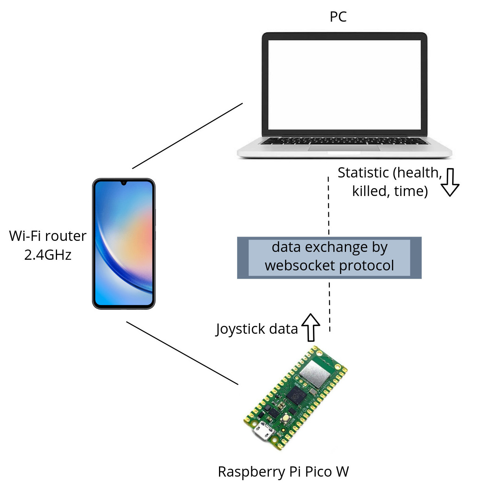

# About project

## Design

## Used parts/components
1. [Microcontroller board Raspberry Pi Pico W (RP2040)](https://www.raspberrypi.com/documentation/microcontrollers/raspberry-pi-pico.html)
2. Breadboard set + jumper wires.
3. OLED display 128x64 (I2C protocol).
4. Joystick KY-023 (ADC protocol)

## Used instruments
1. Micropython with [microdot](https://microdot.readthedocs.io/en/latest/index.html) (backend)
2. Javascript, canvas (frontend)
3. Websocket protocol to data exchange